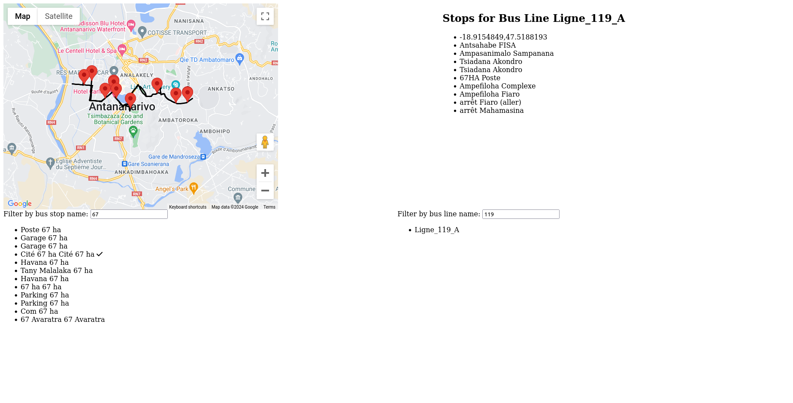

# BetaX mapping data editor

A browser-based tool for enhancing map data for commuting.

## Prerequisites

You need to run the `map-data-server` which is serving the data that
is consumed by this web app.

You also need to set the environment variable `VITE_GOOGLE_MAPS_API_KEY` and `VITE_MAP_DATA_SERVER_URL`
in a `.env` file in the base directory with your Google Maps API key and the URL of the map-data-server respectively.
You can copy the `.env.example` file to `.env` and edit the placeholders and default values there.

The process of creating a new API key is documented here [Generate API
keys](https://developers.google.com/maps/documentation/javascript/get-api-key#create-api-keys)

## Screenshot



# React + TypeScript + Vite

This template provides a minimal setup to get React working in Vite with HMR and some ESLint rules.

Currently, two official plugins are available:

- [@vitejs/plugin-react](https://github.com/vitejs/vite-plugin-react/blob/main/packages/plugin-react/README.md) uses [Babel](https://babeljs.io/) for Fast Refresh
- [@vitejs/plugin-react-swc](https://github.com/vitejs/vite-plugin-react-swc) uses [SWC](https://swc.rs/) for Fast Refresh

## Run in Docker
Install Docker and docker compose and execute the command below, the app runs in http://localhost:8080/

```bash
docker compose up -d
```


## Expanding the ESLint configuration

If you are developing a production application, we recommend updating the configuration to enable type aware lint rules:

- Configure the top-level `parserOptions` property like this:

```js
export default {
  // other rules...
  parserOptions: {
    ecmaVersion: 'latest',
    sourceType: 'module',
    project: ['./tsconfig.json', './tsconfig.node.json'],
    tsconfigRootDir: __dirname,
  },
}
```

- Replace `plugin:@typescript-eslint/recommended` to `plugin:@typescript-eslint/recommended-type-checked` or `plugin:@typescript-eslint/strict-type-checked`
- Optionally add `plugin:@typescript-eslint/stylistic-type-checked`
- Install [eslint-plugin-react](https://github.com/jsx-eslint/eslint-plugin-react) and add `plugin:react/recommended` & `plugin:react/jsx-runtime` to the `extends` list
